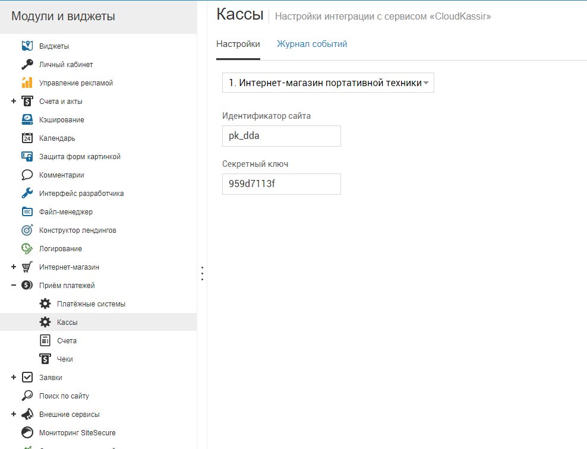
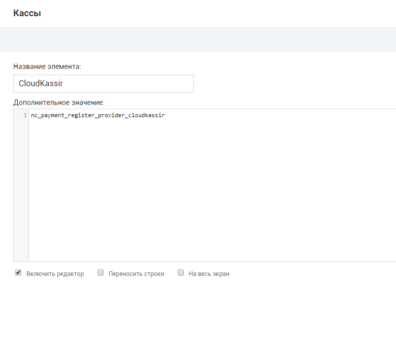

# CloudKassir модуль для NetCat
Модуль позволяет интегрировать онлайн-кассу CloudKassir в интернет-магазин на платформе NetCat.

Подключить кассы можно здесь https://cloudkassir.ru/

### Возможности
* Отправка чеков прихода клиенту по email и с помощью SMS при продаже через любой платежный сервиса
* Отправка чеков возврата клиенту по email и с помощью SMS (ручная)

## Техническая настройка

В настройках онлайн кассы (Настройка -> Прием платежей, затем в дереве слева выбрать раздел "Кассы") необходимо указать ИНН, выбрать систему налогообложения и выбрать используемый модуль "CloudKassir".

Затем перейти "К настройкам кассового сервиса" и указать следующие параметры:

* **Идентификатор сайта** — Public id сайта из личного кабинета CloudPayments
* **Секретный ключ** — API Secret из личного кабинета CloudPayments

После указания всех данных сохранить настройки

## Ручная установка

1) Скопируйте файл cloudkassir.php в каталог netcat/modules/payments/default
2) В файле netcat/modules/payments/default/functions.inc.php добавьте все строки (за исключением первой строки <?php) из файла cloudkassir_functions.inc.php
3) В файле netcat/modules/payments/default/ru.lang.php добавьте все строки (за исключением первой строки <?php) из файла cloudkassir_ru_utf8.lang.php
4) В файле netcat/modules/payments/default/en.lang.php добавьте все строки (за исключением первой строки <?php) из файла cloudkassir_en.lang.php
5) В панели управление NetCat в разделе "Разработка" -> "Списки" добавьте в список "Кассы" онлайн-кассу CloudKassir, где в качестве дополнительного параметра укажите "nc_payment_register_provider_cloudkassir"

